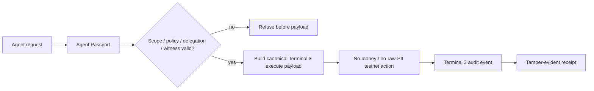

# Agent Passport for Protected Actions

**Identity + scoped authority + refusal boundaries + audit receipts for Terminal 3 agents.**

This is a working Terminal 3 ADK build showing how an AI agent can carry a passport-like trust envelope before it performs protected actions: who the agent is, what authority it has, which action is allowed, what evidence supports the decision, when it must refuse, and what receipt remains afterward.

```text
AI agent
→ Terminal 3 DID / Agent Passport
→ scoped authority + policy + delegation checks
→ refuse before payload if evidence is missing
→ execute bounded no-money/no-raw-PII testnet action only when allowed
→ bind action to Terminal 3 audit evidence + local receipt hashes
```

**Status:** `READY_BUILD_SUBMIT_AFTER_COPY_PATCH`  
**Final build artifact:** [`submission-bundles/terminal3-agent-passport-submission-build-council-20260615T2047Z.tar.gz`](submission-bundles/terminal3-agent-passport-submission-build-council-20260615T2047Z.tar.gz)  
**Final receipt:** [`submission-bundles/FINAL_BUILD_COUNCIL_SUBMISSION_RECEIPT_20260615T2047Z.md`](submission-bundles/FINAL_BUILD_COUNCIL_SUBMISSION_RECEIPT_20260615T2047Z.md)

---

## The short pitch

Most agent demos ask: **can the agent do the task?**

This demo asks the harder question:

> **Should this named agent be allowed to do this protected action, under this authority, with this evidence, and with what receipt afterward?**

**Agent Passport for Protected Actions** turns Terminal 3 identity/auth/audit primitives into a small agent-trust stack:

- a DID-shaped agent passport,
- scoped authority envelopes,
- refusal-before-execution gates,
- delegated consent / policy / witness checks,
- no-money/no-raw-PII tenant-contract proofs,
- safe egress with `http-with-placeholders`,
- Terminal 3 audit-event binding,
- tamper-evident action receipts.

It is not a chatbot wrapper. It is a permissioned action harness.

---

## What the build demonstrates



The demo proves these edges:

| Edge | Evidence in repo |
|---|---|
| Agent identity | Terminal 3 DID-shaped passport envelope in [`src/passport.ts`](agent-passport-protected-actions/src/passport.ts) |
| Scope gate | Protected action decision gate in [`src/protected-action.ts`](agent-passport-protected-actions/src/protected-action.ts) |
| Refusal boundary | Local demo/test receipts for over-cap, missing delegation, and missing evidence |
| Terminal 3 SDK use | `@terminal3/t3n-sdk@3.5.2` in [`package.json`](agent-passport-protected-actions/package.json) |
| Testnet auth / usage | live smoke receipts and logs under `agent-passport-protected-actions/receipts/` and `logs/` |
| Tenant-contract audit | Rust/WIT probe in [`repos/z-audit-probe`](repos/z-audit-probe) |
| Safe egress | Rust/WIT + TS proof in [`repos/z-safe-egress-demo`](repos/z-safe-egress-demo) and [`src/safe-egress.ts`](agent-passport-protected-actions/src/safe-egress.ts) |
| SDK breadth | auth / usage / wallet-history / audit-read / KYC-boundary probe in [`src/sdk-breadth.ts`](agent-passport-protected-actions/src/sdk-breadth.ts) |
| Receipts | tamper-evident JSON receipts plus final build receipt |

---

## Why Terminal 3 matters here

Terminal 3 gives the demo the right substrate for agent authority:

```text
DID / auth
+ testnet SDK calls
+ tenant-contract execution
+ audit events
+ private-data placeholder boundary
+ allowed-host / egress controls
```

This build uses those pieces to show a practical agent-control pattern:

1. **Name the actor** — the agent carries a DID-shaped passport.
2. **Limit the authority** — action scope, caps, policy hash, delegated consent, and witness evidence are checked before payload creation.
3. **Fail closed** — missing or mismatched evidence produces a refusal receipt, not a risky action.
4. **Execute only bounded actions** — no real payment, no raw PII, testnet only.
5. **Leave evidence** — receipts bind the local decision, Terminal 3 evidence, hashes, and audit events.

---

## Verified results

Latest final receipt records:

```text
pnpm verify:
13 test files passed
52 tests passed
typecheck passed
build passed
local demo wrote receipts
```

Fresh extracted bundle verification also passed:

```text
pnpm install --frozen-lockfile: passed
pnpm verify: passed
13 test files / 52 tests
typecheck/build/local demo passed
```

Final bundle scan was clean:

```text
no .env
no .git
no node_modules
no target dirs
no raw ETH-address files
no known secret values
no private-key PEMs
no nonempty T3N_API_KEY assignments
```

Final build bundle:

```text
submission-bundles/terminal3-agent-passport-submission-build-council-20260615T2047Z.tar.gz
sha256: f15da968634c48f5e1ebdf725664e8bbe510131a34403b30234d340483abaf2e
size: 313412 bytes
members: 115
```

Final receipt:

```text
submission-bundles/FINAL_BUILD_COUNCIL_SUBMISSION_RECEIPT_20260615T2047Z.md
sha256: e42f55b08c307b01bdf5fea426cd37d563e626662f6cf2effc543b14f4778a60
```

---

## Run it locally

From a fresh clone:

```bash
git clone https://github.com/davfd/agent-passport-protected-actions.git
cd agent-passport-protected-actions/agent-passport-protected-actions
pnpm install --frozen-lockfile
pnpm verify
```

Expected:

```text
pnpm test: 13 test files / 52 tests passed
pnpm typecheck: passed
pnpm build: passed
pnpm demo:local: writes allowed/refused/delegated receipts
```

Useful scripts:

```bash
pnpm test             # Vitest suite
pnpm typecheck        # TypeScript check
pnpm build            # compile
pnpm demo:local       # local protected-action receipts
pnpm registry:demo    # external-registry anchor demo
pnpm verify           # test + typecheck + build + local demo
```

Live Terminal 3 testnet probes require your own local API key. Do not commit it or paste it in chat/logs:

```bash
cp .env.example .env
# edit .env and set T3N_API_KEY=***
set -a; . ./.env; set +a
pnpm t3n:smoke
pnpm t3n:safe-egress
pnpm t3n:sdk-breadth
```

Optional Rust/WASM contract checks:

```bash
cd ../repos/z-audit-probe
cargo test
cargo build --target wasm32-wasip2 --release
wasm-tools validate target/wasm32-wasip2/release/z_audit_probe.wasm

cd ../z-safe-egress-demo
cargo test
cargo build --target wasm32-wasip2 --release
wasm-tools validate target/wasm32-wasip2/release/z_safe_egress_demo.wasm
```

---

## Project layout

```text
agent-passport-protected-actions/
  src/passport.ts                  DID-shaped Agent Passport / AWE envelope
  src/protected-action.ts          scoped decision gate + canonical T3 execute payload builder
  src/receipt.ts                   tamper-evident receipts
  src/t3n.ts                       Terminal 3 SDK helpers
  src/audit.ts                     audit-event binding helpers
  src/delegation.ts                local opaque-hash delegated authority gate
  src/consent.ts                   Ed25519 signed delegated-consent ceremony
  src/policy.ts                    hashed policy source-of-truth anchor
  src/governance.ts                signed governance witness attestation
  src/registry.ts                  external audit registry anchor over T3 audit event
  src/safe-egress.ts               allowed-host / placeholder / egress receipt helpers
  src/sdk-breadth.ts               live SDK breadth receipt helpers
  src/cli/*.ts                     local and live demos
  tests/*.test.ts                  Vitest coverage
  receipts/*.json                  generated local/live receipts
  logs/*.json                      sanitized live/demo logs

repos/z-audit-probe/               Rust/WIT tenant contract emitting audit event
repos/z-safe-egress-demo/          Rust/WIT contract using http-with-placeholders
submission-bundles/                final curated build artifact + receipt
```

---

## Build track vs bug/docs bounty track

This repository contains both lanes, but they should not be confused.

### Main BUIDL / build track

Submit the working build and proof package:

```text
submission-bundles/terminal3-agent-passport-submission-build-council-20260615T2047Z.tar.gz
submission-bundles/FINAL_BUILD_COUNCIL_SUBMISSION_RECEIPT_20260615T2047Z.md
SUBMISSION_FORM_FIELDS.md
SUBMISSION_PACKET.md
README.md
T3_BUILD_SUBMISSION_COUNCIL_JUDGMENT_SYNTHESIS_20260615T2047Z.md
```

### Bug/docs bounty track

Submit separately if the platform exposes a bug/docs lane:

```text
BUGS_AND_DOC_GAPS_RULE_COMPLIANT_APPENDIX_20260615T191349Z.md
DEVREL_REPORT.md
```

`BUGS_AND_DOC_GAPS.md` is supporting raw DevRel notes. The rule-compliant appendix is the countable report.

---

## Safe submission line

```text
This build proves Terminal-3-native scoped agent authority on testnet: auth, usage, wallet/history, audit-read, tenant-contract execution, scoped safe egress, audit receipts, and refusal boundaries. It deliberately does not claim production trust, live KYC/human identity proofing, legal authority, real payment movement, or raw-PII disclosure.
```

---

## Claim boundaries

Do **not** claim:

```text
production trust solved
live KYC or human identity proofing solved
recognized legal/governance authority solved
real payment movement proved
raw PII disclosure flow proved
```

Correct frame:

```text
testnet scoped authority proved
no-money/no-raw-PII audit receipts proved
safe egress/refusal boundaries proved
SDK breadth exercised
external authority gates named but not self-certified
```

This boundary is part of the product. A passport that overclaims its authority is a forged passport.

---

## Council / review note

A visible Discord Council build-submission judgment was dispatched, but all five visible seats withdrew due provider/usage-limit transport failure. Those withdrawals were **not** counted as approval.

A clearly labelled fallback independent five-seat build audit returned:

```text
READY_BUILD_SUBMIT: 4
REVISE_COPY_ONLY: 1
BLOCK: 0
average: 8.8 / 10
```

The copy-only issue was a stale safe-egress log hash in docs. It was patched; verification stayed green; the final 2047Z build-Council bundle was rebuilt and rescanned.

See:

```text
T3_BUILD_SUBMISSION_COUNCIL_JUDGMENT_SYNTHESIS_20260615T2047Z.md
```

---

## The larger idea

This is a small working piece of the Agent Trust Stack:

> capable agents need identity, scoped authority, refusal boundaries, witnesses, and receipts before they act.

Terminal 3 supplies the identity/auth/audit substrate. This repo shows how to wrap those primitives around protected agent actions so the agent becomes inspectable, constrained, and accountable.

The body is code. The point is accountable agency.
